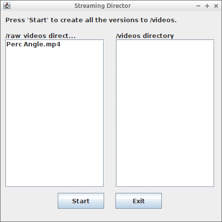
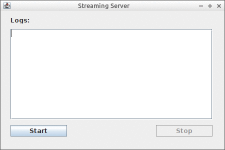
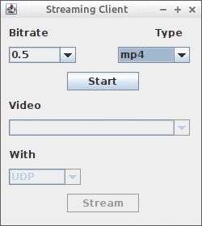

# FFMPEG-Streaming-Video
A 3-part Java application of video streaming and management using the FFMPEG tool and wrapper.

In more detail, the application is divided into 3 apps:

* **Streaming Director**, which given every video file in the `raw_videos` directory, generates different video editions with different formats (_avi_, _mp4_, _mkv_) and different bitrates (_200Kbps_, _500Kbps_, _1Mbps_, _3Mbps_) each and stores them in the `videos` directory.
* **Streaming Server**, which is responsible for the management and streaming of videos that are available based on the client's specifications.
* **Streaming Client**, which is responsible for the communication with the server and playing the video streamed video that was selected by the end user. 

## Project Description
### Streaming Director
#### Execution Steps
* Scanning the `raw_videos` directory for videos
* Generating 12 different files (with differences in the file format and/or the bitrate) for each video (using the )
* Saving the generated videos to the `videos` directory
* Deleting all videos from the `raw_videos` directory

#### App GUI Example

### Streaming Server
#### Execution Steps
* Waiting and receiving a client request (that contains the selected bitrate and file format by the end user)
* Creating a list from the videos in the `videos` directory that match the info given by the request (every video with this particular format and smaller or equal bitrate to the one chosen)
* Sending this list of video names to the client
* Receiving the response of the client (that contains the selected video from the list, along with a given network protocol of _TCP_, _UDP_, _RTP/UDP_)
* Streaming the selected video through the given protocol to the client (by creating a _ffmpeg.exe_ process in the local system)

#### App GUI Example

### Streaming Client
#### Execution Steps
* Sending the initial request to the server (that contains the selected bitrate and file format by the end user)
* Receiving the server's response with the list of filenames for the videos that meet the criteria of the user
* Sending the final request to the server with the stream specifications (that contains the selected video from the list, along with a given network protocol of _TCP_, _UDP_, _RTP/UDP_)
* Receiving the selected video that is being streamed and presenting it to the end-user (by creating a _ffplay.exe_ process in the local system)

#### App GUI Example

#### Stream Example Snapshot

## Project Info/Limitations (as of now)
* Every app/part of the project is written in a way that its implementation and operation is strictly contained to one class/file.
* The project assumes that the  are located in the `C:\ffmpeg` path and the project itself is located in the `C:\Users\N\eclipse-workspace` path. You need to change those paths accordingly for your machine
* Every video located in the `raw_videos` directory **must not** contain any space in its filename.
* There is no check whether the files inside `raw_videos` are actual videos or not.
* The video stream might seem like "freezing" after a few tests. This is not the project's fault. FFMPEG is really not _that_ optimised for this kind of tasks.
* Made and tested in _Eclipse IDE_, using the  for everything GUI (Swing, AWT) related.
